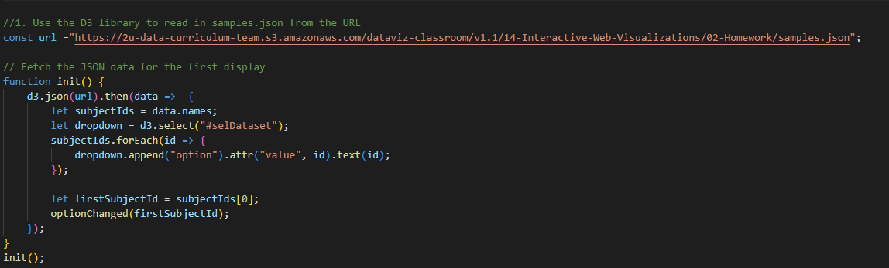
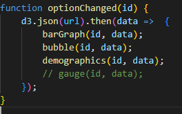
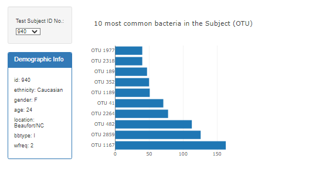
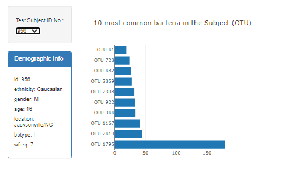
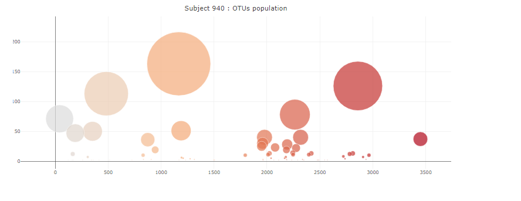
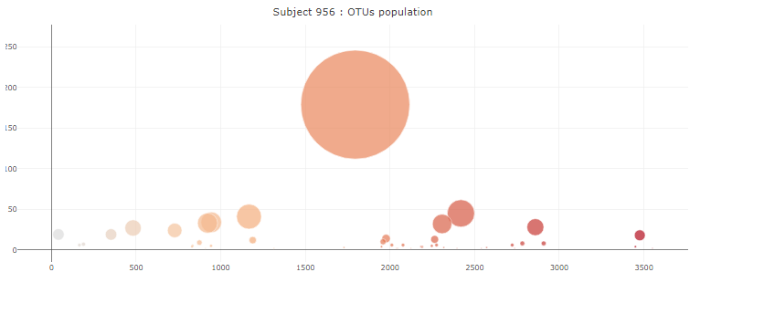
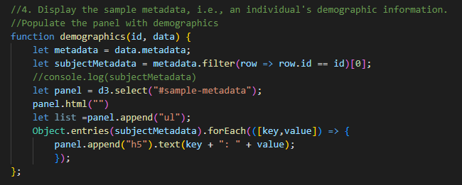
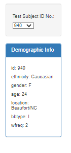
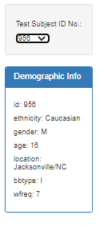

# belly-button-challenge
## Challenge #14

This folder contains the following:  

A folder called **StaterCode** with the *index.html* code and the subfolder **static** that contains the *app.js* code

The folder **Images** with some images provided and the actual output of the challenge

This *Readme* file

----
----

For this challenge we were asked to create some dynamic visualizations of the Belly Button Biodiversity project.

As a first step we needed to create a dropdown button containing all the subjects that provided samples for the study. The following two coding functions are here thanks to my tutor Kourt Bailey who guided me step by step in the writing.  

After these, the first visualization was creating a bar chart that displays the top 10 OTUS in the individual selected with the dropbox. It has a hover feature that shows the label of the OTU displayed. The code was created using Plotly and the results for the first individual are here:

the code also worked for any other individual selected:

The next challenge was to create a bubble chart displaying each sample of OTUs and coloring in accordance to their otu ids with size equals to the sample values. The graph was interactive and change every time a new subject was selected. It also displays the name of the OTU when you hover over it. The result for one of our tests is shown here.

Last we were asked to create a box with the demographic data for each sampled individual. This part also run smoothly and with a lot of help of Kourt Bailey.

As in the previous cases the code delivers consistent results:

  

The box changes every time a new individual is selected:

